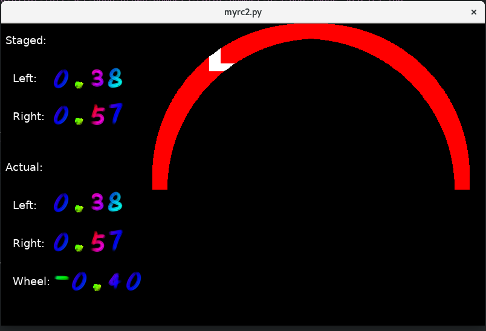

# myrobut
myrobut

ROS2 stuff for [MonsterBorg](https://www.piborg.org/robots-1/monsterborg)

## Usage

### Build ROS2 Packages:
```
docker run --rm -v $PWD/dev_ws:/root/dev_ws myeloquent:latest bash -c "source /opt/ros/eloquent/setup.bash && cd /root/dev_ws && colcon build --packages-select myrobut_interfaces py_myrobut"
```

### Example Run on Service/Robot-Side:
```
docker run --device /dev/i2c-1 -v $PWD/dev_ws:/root/dev_ws --rm --net=host --pid=host myeloquent:latest bash -c "cd /root/dev_ws && source install/setup.bash && ros2 run py_myrobut service"
```

### Example Run on Client/Laptop-Side (Linux/X11 Instructions):
```
# xauth list
# <grab hex portion>
# docker run  -v $PWD/dev_ws:/root/dev_ws -it --net=host --pid=host -v /tmp/.X11-unix:/tmp/.X11-unix -e DISPLAY=${DISPLAY} --privileged --rm myeloquent:latest bash -c 'xauth add $DISPLAY . <<XAUTH_TOKEN>>> && cd /root/dev_ws && source install/setup.bash && ros2 run py_myrobut client"
```

It should pop up a window that looks like:


Use the Arrow keys on the keyboard, PLUS:

A - Spin Left
D - Spin Right


